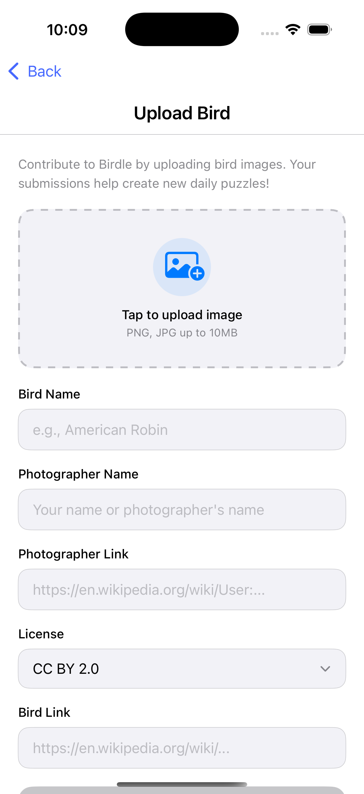

  

## Overview

Birdle is a daily bird guessing puzzle application built with SwiftUI. The app allows users to guess a bird from progressively revealing images, track their completion history, upload new bird images to contribute to the puzzle database, and view game statistics.

## Features
This Birdle application implements a complete daily puzzle game experience with:
- ✅ Splash screen on app launch
- ✅ Home screen with navigation
- ✅ Daily puzzle gameplay with progressive image reveals
- ✅ Autocomplete suggestions for bird names
- ✅ One-try-per-day restriction
- ✅ Time tracking for puzzle completion
- ✅ Copy/share results functionality
- ✅ History tracking of completed puzzles
- ✅ Upload new bird images to remote server
- ✅ Help and About screens
- ✅ Responsive layouts for portrait and landscape
- ✅ Local SQLite database for persistence
- ✅ API integration with easterbilby.net

## Screenshots

### Splash Screen

  

### Home Screen

  

### Puzzle Game

  

### History View

  

### Upload Bird

  

### Help & About

  
  

